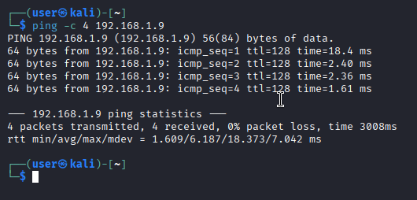
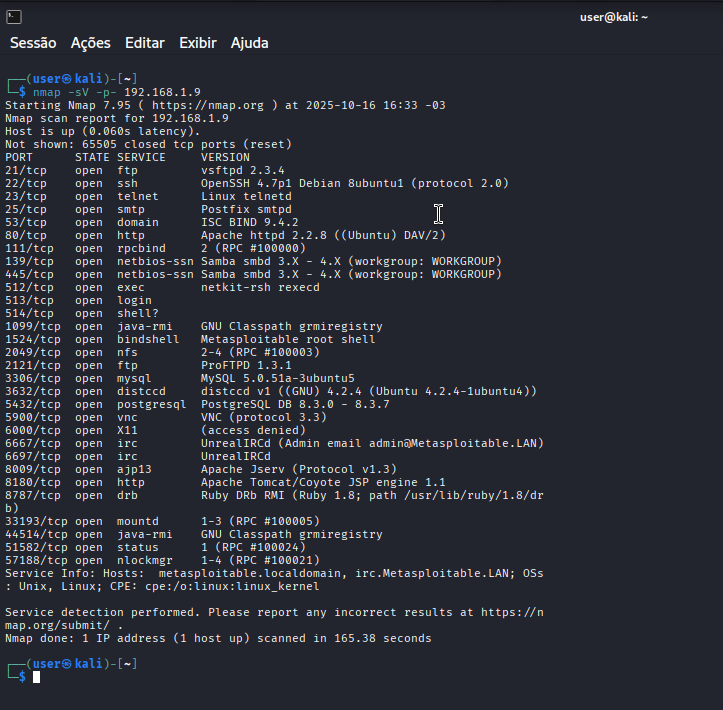
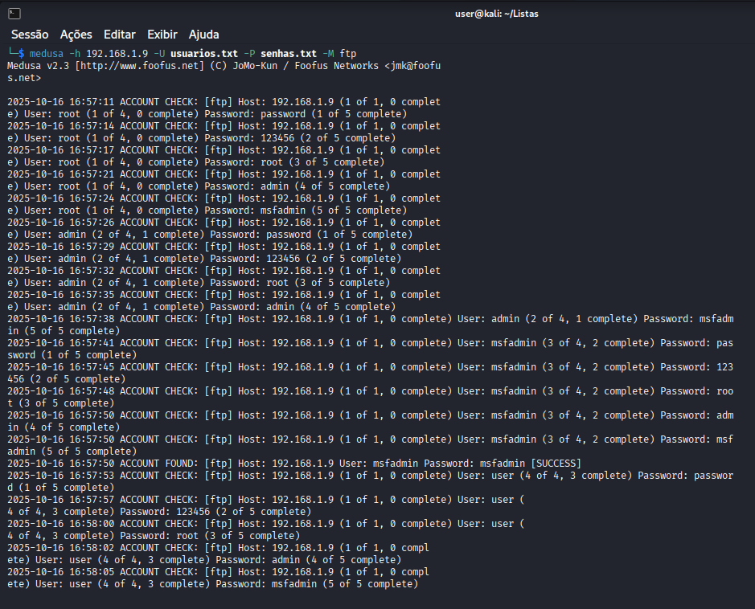
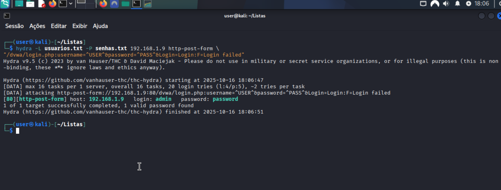
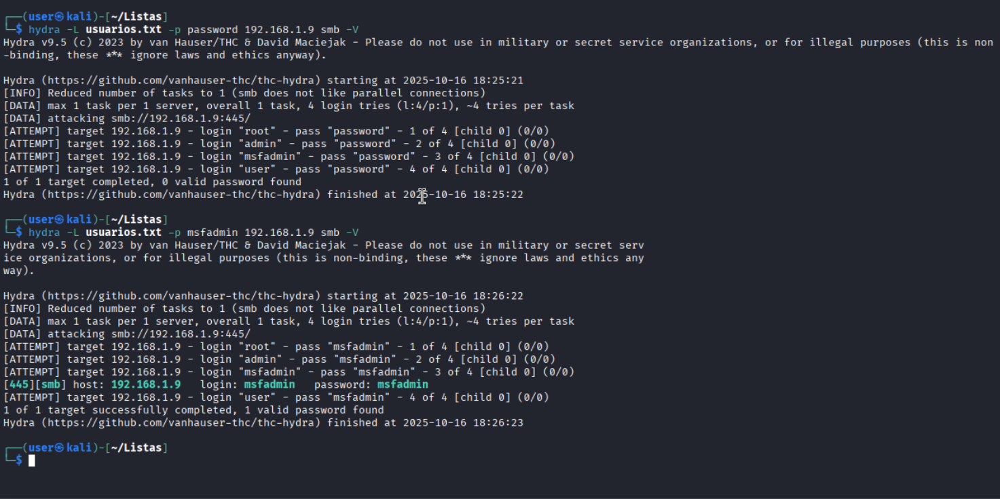

# knock-knock-lab
Laboratório prático de auditoria de segurança para demonstrar vulnerabilidades de força bruta. Ambiente configurado com Kali/Metasploitable 2, executando ataques com Medusa e propondo medidas de mitigação para os serviços testados. #Pentest #EthicalHacking #DIO


# Desafio de Projeto DIO: Laboratório de Pentest com Kali Linux e Medusa


## Sumário

- [Visão Geral do Projeto](#visão-geral-do-projeto)
- [Objetivos de Aprendizagem](#objetivos-de-aprendizagem)
- [Fase 1: Configuração do Ambiente (Setup do Laboratório)](#fase-1-configuração-do-ambiente-setup-do-laboratório)
- [Fase 2: Reconhecimento (Information Gathering)](#fase-2-reconhecimento-information-gathering)
- [Fase 3: Execução dos Ataques (Exploitation)](#fase-3-execução-dos-ataques-exploitation)
  - [Cenário 1: Força Bruta em Serviço FTP](#cenário-1-força-bruta-em-serviço-ftp)
  - [Cenário 2: Força Bruta em Formulário Web (DVWA)](#cenário-2-força-bruta-em-formulário-web-dvwa)
  - [Cenário 3: Password Spraying em Serviço SMB](#cenário-3-password-spraying-em-serviço-smb)
- [Fase 4: Análise de Riscos e Recomendações (Mitigação)](#fase-4-análise-de-riscos-e-recomendações-mitigação)
- [Conclusão e Aprendizados](#conclusão-e-aprendizados)
- [Licença](#licença)
- [Autor](#autor)

---

## Visão Geral do Projeto

Este repositório documenta a execução do Desafio de Projeto da **[Digital Innovation One (DIO)](https://www.dio.me/)**, focado na simulação de ataques de força bruta em um ambiente de laboratório controlado. O objetivo é demonstrar a aplicação prática de técnicas de pentest, utilizando o Kali Linux e a ferramenta Medusa contra alvos vulneráveis, como o Metasploitable 2 e a aplicação web DVWA.

Todo o processo, desde a configuração do ambiente até a proposição de medidas de segurança, está detalhado neste documento.

--------------------------------------------------------------------------------------------------------------------------------------------------

## Objetivos de Aprendizagem

Ao final deste desafio, os seguintes objetivos foram alcançados:

-   **Compreensão Prática:** Entendimento aprofundado de como ataques de força bruta são executados contra diferentes protocolos (FTP, HTTP, SMB).
-   **Uso de Ferramentas:** Utilização proficiente do Kali Linux e do Medusa para realizar auditorias de segurança de forma ética.
-   **Documentação Técnica:** Habilidade de documentar um processo de pentest de forma clara, estruturada e reprodutível.
-   **Análise de Vulnerabilidades:** Reconhecimento de fraquezas comuns relacionadas a senhas e autenticação.
-   **Proposição de Soluções:** Capacidade de recomendar contramedidas e boas práticas de segurança para mitigar os riscos identificados.

--------------------------------------------------------------------------------------------------------------------------------------------------

## Fase 1: Configuração do Ambiente (Setup do Laboratório)

Para garantir um ambiente seguro e isolado, toda a simulação foi realizada em máquinas virtuais.

### 1.1. Software Utilizado
- **Virtualizador:**  VMWare e UTM `versão X.X.X`
- **Máquina de Ataque:** Kali Linux `versão 2025.X`
- **Máquina Alvo:** Metasploitable 2

### 1.2. Configuração de Rede
Ambas as máquinas virtuais foram configuradas para usar uma rede do tipo **"Rede Apenas de Hospedeiro (Host-Only)"**. Isso cria uma rede privada entre a máquina hospedeira e as VMs, isolando completamente o tráfego do laboratório da rede externa.

- **Endereço IP - Kali Linux:** `xxx.xxx.xxx.xxx`  - **Endereço IP - Metasploitable 2:** `192.168.1.9` ### 1.3. Verificação de Conectividade
Após a configuração, a conectividade entre as máquinas foi validada com o comando `ping`.

**Comando (executado no Kali):**
```bash
ping -c 4 192.168.1.9
```
**Evidência:**


--------------------------------------------------------------------------------------------------------------------------------------------------

## Fase 2: Reconhecimento(Information Gathering) e Análise com Ferramentas Automatizadas

Antes de qualquer ataque, um reconhecimento foi realizado para identificar os serviços e portas abertas no alvo. A ferramenta `nmap` foi utilizada para este fim.

**Comando (executado no Kali):**
```bash
nmap -sV -p- 192.168.1.9
```
**Parâmetros do Comando:**
- `-sV`: Tenta determinar a versão dos serviços em execução nas portas abertas.
- `-p-`: Escaneia todas as 65535 portas TCP.

**Resultados:**
O scan revelou diversas portas abertas, incluindo:
- `Porta 21/tcp`: Serviço **FTP** (vsftpd 2.3.4)
- `Porta 22/tcp`: Serviço **SSH** OpenSSH 4.7p1 Debian 8ubuntu1 (protocol 2.0)
- `Porta 80/tcp`: Serviço **HTTP** (Apache httpd 2.2.8 ((Ubuntu) DAV/2)
- `Porta 445/tcp`: Serviço **netbios-ssn** (amba smbd 3.X - 4.X (workgroup: WORKGROUP))
Esses serviços foram selecionados como alvos para a próxima fase.

**Evidência:**


----------------------------------------------------------------------------------------------------------------------------------

## Análise de Vulnerabilidades com Ferramentas Automatizadas

### 2.1 Scanner de Servidor Web (Nikto)
**Objetivo:** Identificar problemas de configuração e vulnerabilidades conhecidas no servidor.

**Output completo disponível em:** `./logs/nikto_scan.txt`

**Principais Vulnerabilidades Detectadas:**

| Vulnerabilidade | Risco | Evidência |
|----------------|------------|-----------|
| Servidor Apache desatualizado (2.2.8) | Alto | Versão EOL identificada |
| Arquivo phpinfo.php exposto | Alto | Informações do sistema acessíveis |
| Diretórios sensíveis acessíveis (/doc/, /test/) | Médio | Listagem de diretórios ativa |
| Método TRACE ativo | Médio | Vulnerável a Cross-Site Tracing |
| phpMyAdmin acessível sem restrições | Alto | Painel administrativo exposto |

**Nota Técnica:**
- **Servidor:** Apache/2.2.8 (Ubuntu) + PHP/5.2.4
- **Problemas de Configuração:** Cabeçalhos de segurança ausentes (X-Frame-Options, X-Content-Type)
- **Arquivos Expostos:** phpinfo.php, phpMyAdmin, diretórios do sistema

**Recomendação Imediata:** Atualizar servidor web e restringir acesso a arquivos sensíveis.

## 2.2 Scanner de Aplicação Web (Wapiti)

**Objetivo:** Analisar vulnerabilidades específicas na aplicação DVWA.

**Output completo disponível em:** `./logs/scan_wapiti.txt`

**Principais Vulnerabilidades Detectadas:**

| Categoria | Vulnerabilidade | Risco | Evidência |
|-----------|----------------|------------|-----------|
| **Content Security Policy** | CSP não configurado | Médio | Falta cabeçalho Content-Security-Policy |
| **HTTP Headers** | X-Frame-Options ausente | Médio | Permite clickjacking |
| **HTTP Headers** | X-XSS-Protection ausente | Médio | Sem proteção contra XSS |
| **HTTP Headers** | X-Content-Type-Options ausente | Médio | Permite MIME sniffing |
| **HTTP Headers** | Strict-Transport-Security ausente | Médio | Sem forçar HTTPS |
| **Cookies** | HttpOnly flag não configurada (PHPSESSID) | Médio | Cookie acessível via JavaScript |
| **Cookies** | HttpOnly flag não configurada (security) | Médio | Cookie acessível via JavaScript |
| **Cookies** | Secure flag não configurada (PHPSESSID) | Médio | Cookie transmitido em texto claro |
| **Cookies** | Secure flag não configurada (security) | Médio | Cookie transmitido em texto claro |

### Resumo das Vulnerabilidades por Categoria

| Categoria | Quantidade | Status |
|-----------|------------|---------|
| HTTP Security Headers | 4 vulnerabilidades | Crítico |
| Cookie Security | 4 vulnerabilidades | Crítico |
| Content Security Policy | 1 vulnerabilidade |  Médio |
| SQL Injection | 0 vulnerabilidades | Seguro |
| XSS | 0 vulnerabilidades | Seguro |
| Path Traversal | 0 vulnerabilidades |  Seguro |

### Impacto Geral

**Configurações de segurança inadequadas:**
- Ataques cross-site (XSS)
- Clickjacking
- Exposição de dados sensíveis
- Session hijacking

### Recomendações

1. **Implementar cabeçalhos de segurança HTTP**
2. **Configurar flags de segurança em cookies**
3. **Adotar Content Security Policy**
4. **Forçar uso de HTTPS**
5. **Proteger contra clickjacking**
6. **Bloquear MIME sniffing**
7. **Isolar cookies de scripts client-side**

--------------------------------------------------------------------------------------------------------------------------------------------------

## Fase 3: Execução dos Ataques (Exploitation)

Com os alvos identificados, a ferramenta **Medusa** foi utilizada para executar os ataques de força bruta.

### Cenário 1: Força Bruta em Serviço FTP

- **Objetivo:** Obter acesso não autorizado ao serviço FTP (porta 21) no Metasploitable 2.
- **Wordlists Utilizadas:**
  - `usuarios.txt` (contendo `root`, `admin`, `msfadmin`)
  - `senhas.txt` (contendo `toor`, `admin`, `msfadmin`, `password`)

**Comando (executado no Kali):**
```bash
medusa -h 192.168.1.9 -U usuarios.txt -P senhas.txt -M ftp
```
**Parâmetros do Comando:**
`-h` 192.168.1.9: O parâmetro -h (de host) especifica o alvo do ataque, que é o endereço IP 192.168.1.9.
`-U` usuarios.txt: O parâmetro -U (de User file) indica o arquivo que contém a lista de usuários a serem testados.
`-P` senhas.txt: O parâmetro -P (de Password file) indica o arquivo que contém a lista de senhas a serem testadas para cada usuário.
`-M` ftp: O parâmetro -M (de Module) define qual serviço (módulo) será atacado. Neste caso, foi o ftp.)

**Funcionamento:**
O Medusa testa automaticamente todas as combinações de usuários e senhas dos arquivos contra o serviço FTP do servidor 192.168.1.9.

**Resultados:**
O ataque foi bem-sucedido, revelando a credencial válida: **`msfadmin` / `msfadmin`**.

**Evidência:**


--------------------------------------------------------------------------------------------------------------------------------------------------
### Cenário 2: Força Bruta em Formulário Web (DVWA)

- **Objetivo:** Comprometer o formulário de login da página "Brute Force" do Damn Vulnerable Web Application (DVWA), rodando no Metasploitable 2 e configurado com a segurança no nível `Low`.

**Comando (executado no Kali):**
```bash
hydra -L usuarios.txt -P senhas.txt 192.168.1.9 http-post-form \
"/dvwa/login.php:username=^USER^&password=^PASS^&Login=Login:F=Login failed"
```
**Parâmetros do Comando:**
- `-L usuarios.txt`: Arquivo contendo lista de usuários para teste.
- `-P senhas.txt`: Arquivo contendo lista de senhas para teste.
- `192.168.1.9`: IP do servidor/alvo do ataque
- `http-post-form`: Módulo para ataque em formulários web via POST
- `-m FORM:"..."`: Define a URL e os parâmetros do formulário, usando `^USER^` e `^PASS^` como placeholders.

**Estrutura do Formulário:**
- `/dvwa/login.php`: URL do formulário.
- `username=^USER^&password=^PASS^&Login=Login`: Parâmetros do formulário, usando `^USER^` e `^PASS^` como placeholders.
- `F=Login failed`: Mensagem de erro esperada.

**Funcionamento:**
O Hydra testa automaticamente todas as combinações de usuários e senhas nos arquivos, substituindo ^USER^ e ^PASS^ a cada tentativa, e para quando encontrar credenciais válidas (quando a mensagem "Login failed" não aparece).

**Resultados:**
[80][http-post-form] host: 192.168.1.9   login: admin   password: password

A senha para o usuário `admin` foi descoberta: **`password`**.

**Evidência:**


__________________________________________________________________________________________________________________________________________________

## Cenário 3: Password Spraying em Serviço SMB

- **Objetivo:** Executar um ataque de *Password Spraying* contra o serviço SMB (porta 445), testando uma única senha fraca contra múltiplos usuários.
- **Senhas Testadas:** `password` e `msfadmin`

**Comando (executado no Kali):**
```bash
hydra -L usuarios.txt -p msfadmin 192.168.1.9 smb -V
```
**Parâmetros do Comando:**
- `-L usuarios.txt`: Arquivo contendo lista de usuários para teste
- `-p msfadmin`: Usa uma senha fixa (msfadmin) para todos os usuários
- `192.168.1.9`: IP do servidor/alvo do ataque
- `smb`: Módulo para ataque ao protocolo SMB (Server Message Block - compartilhamento de arquivos Windows)
- `-V`: Modo verbose - mostra cada tentativa em tempo real

**Funcionamento:****
O Hydra testa cada usuário do arquivo usuarios.txt com a senha fixa msfadmin no serviço SMB do alvo, mostrando todas as tentativas na tela devido ao -V.

**Diferença do anterior:**
    Antes: Ataque a formulário web com múltiplas senhas
    Agora: Ataque a serviço SMB com senha fixa e múltiplos usuários

**Resultados:**
O ataque identificou que o usuário **`msfadmin`** possuía a senha `msfadmin`, permitindo o acesso aos compartilhamentos de rede.

**Evidência:**


--------------------------------------------------------------------------------------------------------------------------------------------------


## Fase 4: Análise de Riscos e Recomendações (Mitigação)

*Os ataques demonstraram que senhas fracas representam um risco crítico para a segurança dos serviços. As seguintes contramedidas são recomendadas:*

| Risco Identificado | Medida de Mitigação | Por que é Importante? |
| :------------------| :------------------ | :-------------------- |
| **Senhas Fracas e Padrão** | Implementar uma **Política de Senhas Fortes** (comprimento, complexidade, histórico). | Dificulta exponencialmente a adivinhação de senhas por ferramentas automatizadas. |
| **Tentativas de Login Ilimitadas** | Configurar o **Bloqueio de Contas (Account Lockout)** após X tentativas falhas. | Impede que um atacante possa testar milhões de senhas em um curto período, tornando o ataque inviável. |
| **Automação de Ataques Web** | Utilizar **CAPTCHA** ou reCAPTCHA em formulários de login. | Adiciona uma camada que exige interação humana, quebrando a maioria dos scripts de força bruta. |
| **Comprometimento de Credenciais** | Habilitar a **Autenticação de Múltiplos Fatores (MFA)**. | **A medida mais eficaz.** Mesmo que a senha seja roubada, o atacante não terá o segundo fator (token, biometria, etc). |
| **Falta de Visibilidade** | Implementar **Monitoramento e Alertas** para múltiplas falhas de login. | Permite que a equipe de segurança detecte e responda a um ataque em andamento antes que ele seja bem-sucedido. |

--------------------------------------------------------------------------------------------------------------------------------------------------

## Conclusão

Este desafio prático foi fundamental para consolidar o entendimento sobre a mecânica dos ataques de força bruta. A principal lição é que a segurança de um sistema é tão forte quanto sua senha mais fraca. A execução em um ambiente de laboratório permitiu explorar as capacidades de ferramentas ofensivas como o Medusa de forma segura e ética, reforçando a mentalidade de que, para defender um sistema, é preciso primeiro entender como atacá-lo.

---

## Licença

Este projeto está licenciado sob a Licença MIT. Consulte o arquivo `LICENSE` para mais detalhes.

---

## Autor

**[Seu Nome Completo]**

[](https://www.linkedin.com/in/seu-linkedin/)
[](https://github.com/seu-github/)
````


__________________________________________________________________________________________________________________________________________________
